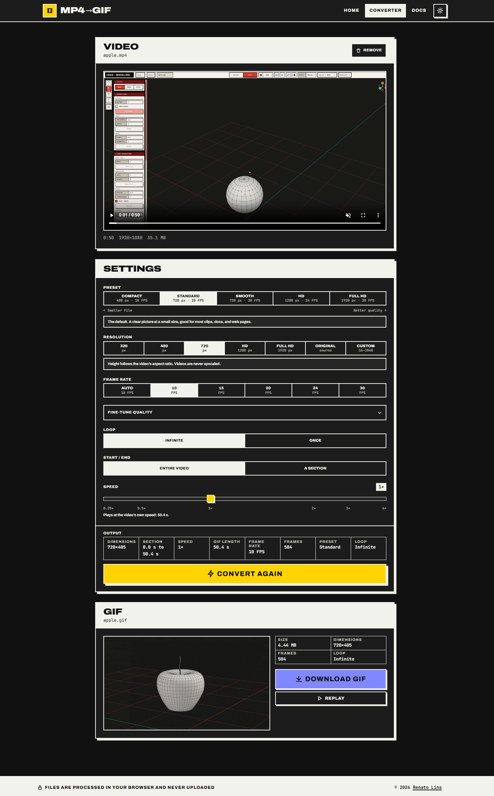
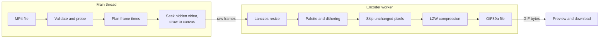

# MP4 to GIF

Convert MP4 videos into optimized animated GIFs (Graphics Interchange Format) right in your browser. Videos are decoded, encoded, and downloaded on your device. Nothing is uploaded, and there's no server or account.



## Features

- **Fully local.** The browser's own video decoder reads the MP4 and a background thread writes the GIF. Fonts are bundled too, so the app makes no third-party requests.
- **Five presets**, from Compact (480 px wide, 64 colors) to Full HD (1920 px wide, 256 colors per frame, 30 frames per second).
- **Output controls:** width (preset sizes, the video's own width, or a custom 16 to 3840 px, never upscaled), frame rate, loop or play once, a start and end time, and playback speed from 0.25× to 4×.
- **Fine-tune quality:** colors per palette, dithering, a shared or adaptive palette, how much frame-to-frame noise to ignore, and lossy compression.
- **Small files:** only pixels that changed are stored, each frame is cropped to the area that changed, identical frames are merged, and an optional lossy stage trades a little grain for size.
- **Clear limits:** non-MP4 files, files over 2 GB, codecs the browser can't decode, and clips too long for browser memory are caught up front, with a message that says what to change.
- **Searchable in-app docs** at `/docs` that explain every setting. Their numbers come from the same constants the encoder uses, so they can't drift.
- **Accessible and responsive:** keyboard navigation, focus management between pages, screen reader labels, reduced motion support, and light and dark themes.

## How it works



1. **Validate.** The file's first bytes must look like an MP4 container, whatever its name says. The app then decodes one real frame for the thumbnail, which catches unsupported codecs right away instead of halfway through a conversion.
2. **Plan.** Settings and the video's metadata become an exact list of frame timestamps and delays. GIF stores delays in hundredths of a second, so rounding is spread across frames to keep the total length exact.
3. **Capture.** A hidden `<video>` element seeks to each timestamp and the frame is drawn to a canvas, halving its size in clean 2× steps while it's still larger than the output.
4. **Encode.** In a Web Worker, each frame is resized with a Lanczos filter, mapped to a palette of up to 256 colors with dithering, compared against what's already on screen, cropped to the changed area, and compressed with LZW (Lempel-Ziv-Welch), optionally lossy.
5. **Download.** The finished GIF comes back to the page without being copied, for preview and download.

The full story, stage by stage, is in [docs/encoding.md](docs/encoding.md).

## Presets

A preset sets the width, the frame rate in frames per second (FPS), and five quality settings in one click. Any of them can be changed afterward.

| Preset             | Width   | FPS | Colors | Palette  | Dithering | Pixel skip | Lossy  |
| ------------------ | ------- | --- | ------ | -------- | --------- | ---------- | ------ |
| Compact            | 480 px  | 10  | 64     | Shared   | Ordered   | Strong     | Strong |
| Standard (default) | 720 px  | 10  | 128    | Shared   | Ordered   | Medium     | Medium |
| Smooth             | 720 px  | 20  | 256    | Adaptive | Ordered   | Light      | Light  |
| HD                 | 1280 px | 24  | 256    | Adaptive | Ordered   | Off        | Medium |
| Full HD            | 1920 px | 30  | 256    | Adaptive | Diffusion | Off        | Light  |

Each step down the table looks better and makes bigger files. Every column is explained on the app's `/docs` page.

## Getting started

You'll need Node.js 22 (22.22.1 or later) or Node.js 24, and npm.

```bash
npm install
npm run dev
```

Then open `http://localhost:5173`.

| Command                 | What it does                                   |
| ----------------------- | ---------------------------------------------- |
| `npm run dev`           | Start the dev server with hot reload           |
| `npm run build`         | Type check and build for production to `dist/` |
| `npm run preview`       | Serve the production build locally             |
| `npm test`              | Run the test suite once                        |
| `npm run test:coverage` | Run tests with a coverage report               |
| `npm run lint`          | Lint with ESLint                               |
| `npm run typecheck`     | Type check without building                    |
| `npm run format`        | Format with Prettier                           |

A pre-commit hook lints and formats staged files, then runs the type check and the full test suite.

## Tech stack

- **React 19** and **React Router 8**, with lazy-loaded routes
- **TypeScript 6** in strict mode
- **Vite 8** for the dev server and build, with the encoder bundled as a separate worker chunk
- **Sass** with CSS Modules and a token-based light and dark theme
- **Zod** for validating form input
- **gifenc**, used only for its color quantizer. The GIF writer, LZW compressor, resampler, dithering, and frame differencing are written for this project.
- **Vitest**, **React Testing Library**, and **jsdom** for tests, including a small GIF decoder that checks what the encoder's output actually looks like

Why each piece is there, and what was left out on purpose, is in [docs/stack.md](docs/stack.md).

## Project structure

```text
src/
  app/            App shell: providers and layout
  routes/         Router with lazy-loaded pages
  pages/          Home, Converter, Docs, Not Found, route error page
  domain/         Everything specific to video and GIF
    components/   Drop zone, settings, result panel, and more
    hooks/        Conversion state machine, docs search
    services/     Video capture, encoder worker, GIF writer, LZW
    helpers/      Presets, planning, pixels, resampling, errors, docs content
    types/        Settings, plan, job, and docs types
  shared/         Generic components, hooks, helpers, and icons
  global-styles/  Reset, theme tokens, mixins, animations
  tests/          Test setup, fixtures, and a GIF decoder
```

## Documentation

Developer documentation lives in [`docs/`](docs/). If you're new to the code, read Architecture first, then Development before your first commit, and Encoding before touching the encoder.

- [Architecture](docs/architecture.md): layers, data flow, the job lifecycle, and the worker boundary
- [Stack, dependencies, and plugins](docs/stack.md): every library and tool, and why
- [Encoding](docs/encoding.md): the GIF pipeline in depth
- [Techniques](docs/techniques.md): concurrency, cancellation, memory, state, and accessibility techniques
- [Performance](docs/performance.md): where time and memory go, the memory budget, and bundle size
- [Development](docs/development.md): setup, workflow, common tasks, debugging, and deployment
- [Testing](docs/testing.md): how the suite is organized and how the encoder is tested

Two other places hold documentation, each for a different reader:

- The **`/docs` page in the app** is for users: what each setting does to their GIF. Its content is data in `src/domain/helpers/docsContent.ts`.
- **[`.claude/`](CLAUDE.md)** holds the coding conventions that contributors and Claude Code both follow.

When a change affects more than one of these, update them in the same pull request.

## Browser support and limits

- Needs a current Chromium-based browser, Firefox, or Safari with module Web Workers.
- Must be served over Hypertext Transfer Protocol Secure (HTTPS) or from `localhost`, because the app uses `crypto.randomUUID()`, which browsers only expose in secure contexts.
- Reads any MP4 or M4V the browser can decode. H.264 works everywhere. High Efficiency Video Coding (HEVC, or H.265), the default on some phones, depends on the browser and operating system.
- Source files can be up to 2 GB.
- The finished GIF is held in memory until downloaded, so long, large clips are refused before starting. At Full HD and 30 FPS, that's about 19 seconds of GIF. The settings panel shows how much fits at the current settings.
- One video at a time. GIFs have no audio, so sound is dropped.

## Privacy

Files are read, converted, and downloaded on your device. There's no backend, no analytics, and no network request involving your video. Closing or reloading the tab discards everything that wasn't downloaded.

## License

[MIT](LICENSE) © 2026 Renato Lins
