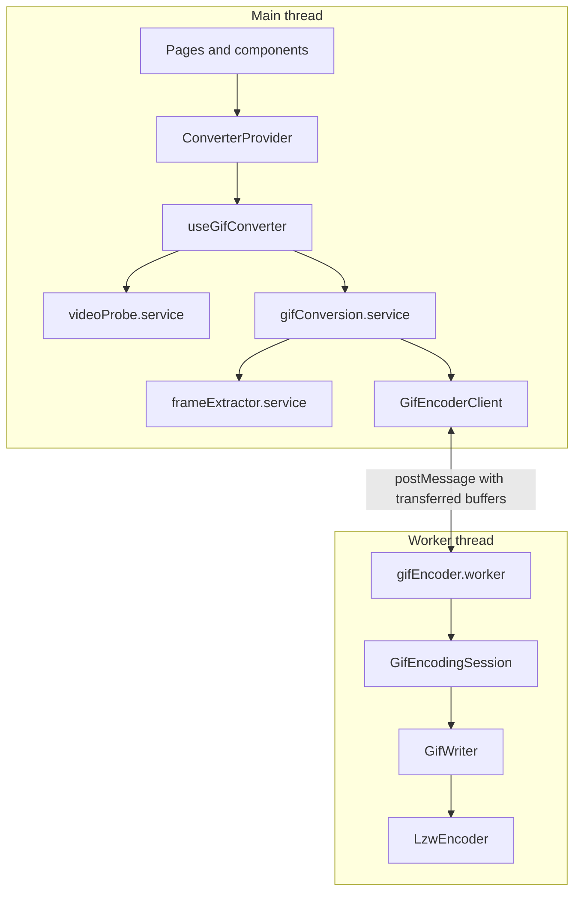
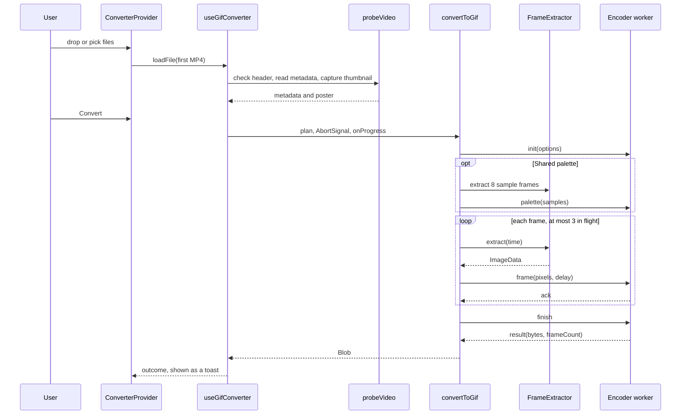
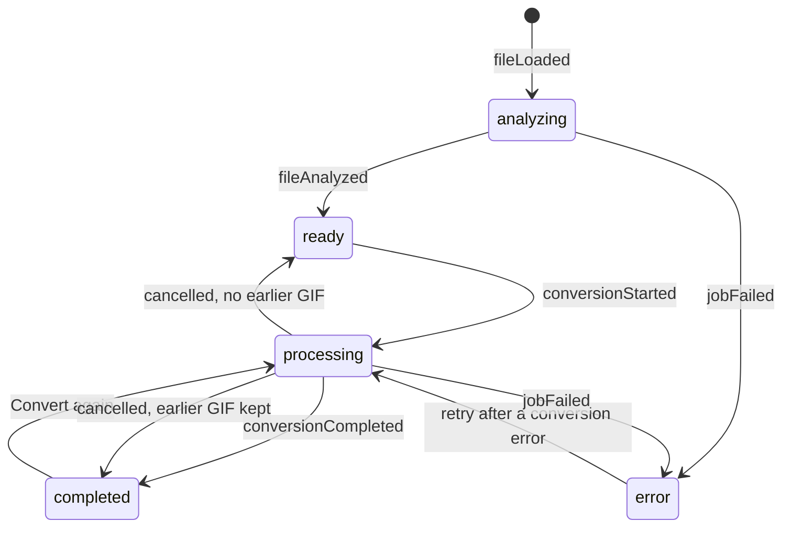

# Architecture

The converter is a client-only single-page application (SPA). There is no backend: the browser decodes the video, a Web Worker encodes the GIF (Graphics Interchange Format), and the result is downloaded from memory. This document maps the code and follows a conversion through it.

## Overview



The work is split across two threads:

- **Main thread:** the user interface (UI), file validation, and frame capture. Frame capture stays here because it relies on an `HTMLVideoElement`, which only exists on the main thread.
- **Worker thread:** everything compute-heavy, from resizing frames to compressing them, so the page stays responsive during a conversion.

## Folder structure

```text
src/
  main.tsx              Entry point: fonts, global styles, React root
  app/                  App shell: providers and the page layout (header, nav, footer)
  routes/               Central router with lazy-loaded pages
  pages/                One folder per route: Home, Converter, Docs, Donate, NotFound, RouteError
  domain/               Everything specific to turning video into GIFs
    components/         Domain UI: drop zone, settings form, result panel, docs entry card, donation card
    hooks/              useGifConverter (conversion state machine), useConverter, useDocsSearch, useDonationAmount
    services/
      video/            Probing and frame capture with a hidden <video> element
      gif/              Worker, worker client, protocol, encoding session, GIF writer, LZW
      gifConversion.service.ts   Orchestrates capture and encoding for one GIF
    helpers/            Presets, conversion plan, pixel mapping, resampling, errors, docs content, donation
    types/              Settings, plan, job, and docs types
  shared/               Generic building blocks with no knowledge of video or GIFs
    components/         Button, Modal, Toast, Slider, SegmentedControl, TextField, and others
    hooks/              Theme, toast, focus shortcut, scroll to hash
    helpers/            Formatters, class name joiner, file download
    icons/              Inline SVG icon set
  global-styles/        Reset, design tokens, helpers, responsive mixins, animations
  tests/                Test setup, fixtures, and a minimal GIF decoder
  types/                Declarations for untyped packages (gifenc)
```

LZW is Lempel-Ziv-Welch, the compression GIF uses. SVG is Scalable Vector Graphics.

## Dependency rules

These hold today, and code review should keep them that way:

- **`shared/` never imports from `domain/`.** Shared components are presentation-only and reusable anywhere.
- **`domain/services/` and `domain/helpers/` never import React.** They're plain TypeScript, so they run inside the worker and can be unit tested without rendering anything.
- **Helpers versus services.** Helpers hold logic worth testing on its own (planning, presets, pixel math, resampling, search). Services hold the code that talks to browser media APIs or the worker.
- **Pages stay thin.** They read state from `useConverter()` and compose domain components.
- **Imports use the `@/` alias.** ESLint rejects imports that start with `../../`.

## Component tree

```text
<StrictMode>
  <App>
    <ToastProvider>
      <ConverterProvider>        conversion state lives here, above the router
        <RouterProvider>
          <AppLayout>            header, nav, theme toggle, footer, focus handling
            <HomePage /> | <ConverterPage /> | <DocsPage /> | <NotFoundPage />
```

`ConverterProvider` sits above the router on purpose. A conversion keeps running while the user reads the docs, and the result is still there when they come back.

## Settings, plan, and encoding parameters

Three types in `src/domain/types/conversion.ts` describe a conversion at increasing levels of detail:

| Type                 | Holds                                                                                                                 | Produced by                               |
| -------------------- | --------------------------------------------------------------------------------------------------------------------- | ----------------------------------------- |
| `ConversionSettings` | What the user picked: preset, tuning overrides, width option, frame rate option, loop, section, speed                 | The settings form                         |
| `ConversionPlan`     | What will happen: output dimensions, frames per second, every frame timestamp and delay, and resolved encoding values | `buildConversionPlan(settings, metadata)` |
| `EncodingParams`     | Encoder values: palette size, color format, palette mode, dithering, pixel skip threshold, lossy tolerance            | `resolveEncoding(preset, tuning)`         |

`buildConversionPlan` is a pure function. The settings panel calls it on every render to show the output summary and the memory warning, and the conversion calls it once to run. Because both use the same function, the summary always describes what the encoder will do.

A preset is a starting point, not a mode. `applyPreset` sets the width and frame rate and clears any tuning. Each field in `QualityTuning` then overrides one preset value, and a missing field follows the preset.

## Conversion flow



## Job lifecycle

`useGifConverter` owns a single `ConversionJob` and drives it with `useReducer` (`converterReducer.ts`). The converter handles one file at a time.



- `analyzing` covers the short window while the probe reads metadata and captures the poster frame. A failure here (invalid file, corrupted, unsupported codec) leaves no metadata, so the job can't be converted.
- Removing or replacing the file (`fileCleared`) ends the job from any state, aborting a running conversion.
- Cancelling a re-run keeps the previous GIF. Only a successful conversion replaces it.

Every async action reports back with the id of the job it started on. `updateJob` in the reducer drops any update whose id doesn't match the current job, so a probe or conversion that finishes after the user replaced the file can't overwrite the new one. [Techniques](techniques.md#stale-async-results) has the details.

## The worker boundary

Four files make up the boundary, each with one job:

| File                    | Role                                                                                                                  |
| ----------------------- | --------------------------------------------------------------------------------------------------------------------- |
| `gifEncoderProtocol.ts` | Typed request and response messages. Every request carries an `id` and gets exactly one reply.                        |
| `gifEncoderClient.ts`   | Main-thread wrapper. Turns messages into promises, transfers pixel buffers, and terminates the worker on `dispose()`. |
| `gifEncoder.worker.ts`  | Thin dispatcher. Routes each request to the session and turns thrown errors into `error` replies.                     |
| `gifEncodingSession.ts` | The encoder itself. It has no worker-specific code, so tests call it directly.                                        |

Requests are `init`, `palette`, `frame`, and `finish`. Replies are `ack`, `result`, and `error`.

- If the worker crashes, the client rejects every pending request with `conversion-failed`.
- If the user cancels, the client terminates the worker and rejects every pending request with `cancelled`.

## Error model

Every expected failure is a `ConversionError` with a code from a closed set, defined in `conversionErrors.ts`. Each code has a user-facing message that says what to change.

| Code                   | Raised when                                                                                             |
| ---------------------- | ------------------------------------------------------------------------------------------------------- |
| `invalid-mp4`          | The first bytes don't match an MP4 container layout                                                     |
| `corrupted`            | The file is empty, its duration is unreadable, decoding fails, or loading or seeking times out          |
| `unsupported-encoding` | The browser can't decode the codec (often High Efficiency Video Coding, HEVC) or there's no video track |
| `file-too-large`       | The file is over 2 GB                                                                                   |
| `insufficient-memory`  | The plan exceeds the memory budget, a canvas can't be created, or an allocation fails                   |
| `conversion-failed`    | Anything else                                                                                           |
| `cancelled`            | The user cancelled, or removed the file mid-conversion                                                  |

`toConversionError` maps anything thrown (abort `DOMException`s, `RangeError`s and out-of-memory messages, unknown errors) onto one of these codes. `mediaErrorToConversionError` does the same for `<video>` errors.

Where errors appear:

- Analysis errors show in the video panel, since there's nothing to convert.
- Conversion errors show under the settings, next to the Convert button.
- Every conversion outcome (done, failed, cancelled) also shows as a toast.

## Routing

- `createBrowserRouter` with five lazy-loaded routes: `/`, `/converter`, `/docs`, `/donate`, and a catch-all not found page. Each page downloads only when first visited.
- Two error boundaries. A pathless route inside the layout catches page errors and shows them with the header and navigation still working. A second boundary on the layout itself catches errors in the shell.
- `RouteErrorPage` is imported eagerly, because it has to render when a lazy page chunk is what failed to load.
- On each navigation after the first render, `AppLayout` moves focus to `<main>` and scrolls to the top, as a full page load would.

## Styling

- Each component has its own `.module.scss`. Global CSS (Cascading Style Sheets) lives only in `src/global-styles/`.
- `theme.scss` defines design tokens as Sass variables that point at CSS custom properties, for example `$color-primary: var(--color-primary)`. Light and dark themes swap the custom properties at runtime, and component styles never hardcode colors.
- `index.scss` applies the dark values under `prefers-color-scheme: dark` unless `<html data-theme="light">` is set, and under `data-theme="dark"` regardless. `useTheme` sets that attribute once the user picks a theme and remembers the choice in `localStorage`.
- Breakpoints are mobile-first, at 640 px (tablet) and 1024 px (desktop), through the mixins in `responsive-mixins.scss`.
- The visual language, described at the top of `theme.scss`, is "friendly brutalism": thick borders, hard offset shadows, square corners, and one loud accent color.

## In-app documentation

The `/docs` page is data, not markup. `docsContent.ts` exports sections and entries, and every number in them (preset values, thresholds, tolerances, size limits, how many seconds fit in memory) is read from the constants the encoder uses. Changing a preset updates the Home page table and the docs with no extra edits.

The search query lives in the URL (`/docs?q=dither`), so a search can be shared or bookmarked.

## Donations

The `/donate` page sends donors to PayPal with a plain link, not PayPal's JavaScript software development kit. `buildPayPalDonateUrl` in `donation.ts` points at PayPal's hosted donate page and fills in the recipient's email (`business`), the amount, and the currency. A personal PayPal account has no hosted button ID, so the email is how that page identifies the recipient.

A link keeps two things true that the rest of the app relies on. The app makes no third-party requests until the donor clicks, and payment details never touch this site. PayPal handles the payment in a new tab.

- The presets, the minimum and maximum, and the recipient email are constants at the top of `donation.ts`.
- `useDonationAmount` tracks the chosen preset or typed amount and builds the link. The donate button stays disabled until the amount is valid.
- A typed amount goes through a Zod schema that also accepts a comma as the decimal mark ("7,50"). Its error appears only after the field loses focus, so a half-typed amount isn't flagged.
- On mobile the header has no room for a fourth nav link, so Donate is a heart icon next to the logo there, and a nav item from tablet up.
