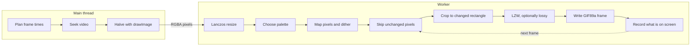

# Encoding

How a frame of video becomes part of a GIF (Graphics Interchange Format). This is the most intricate part of the codebase. Most of it lives in four places:

- `src/domain/helpers/conversionPlan.ts`: which frames to capture and how long each one shows.
- `src/domain/helpers/resample.ts`: resizing frames.
- `src/domain/helpers/gifPixels.ts`: palette lookups, dithering, and deciding which pixels to skip.
- `src/domain/services/gif/`: the encoding session, the GIF writer, and the compressor.

## Design goal

Make the best-looking GIF for its size, and when quality has to go, make the loss look like fine, even grain. Structured artifacts count as bugs, even when they'd save bytes:

- **Ghosts:** a faint copy of something that moved away, left behind because its pixels were skipped as "unchanged".
- **Streaks:** horizontal smears from lossy compression nudging pixels the same way along a row.
- **Banding:** visible steps in a gradient, from too few colors and no dithering.

Most tuning constants below exist to keep one of these in check. When you change the encoder, judge the result by decoding frames and looking at them, not only by the byte count, and report any size cost honestly.

## What a GIF can hold

GIF89a, the version this app writes, dates from 1989. Its hard limits each shape part of the encoder:

| Limit                                                                    | Consequence                                      | Handled in                                                                     |
| ------------------------------------------------------------------------ | ------------------------------------------------ | ------------------------------------------------------------------------------ |
| At most 256 colors per frame, from a palette                             | Every frame is quantized, and usually dithered   | [Palette](#4-choosing-a-palette), [dithering](#5-mapping-pixels-and-dithering) |
| One palette index can be transparent                                     | It marks "unchanged since the last frame"        | [Storing only what changed](#6-storing-only-what-changed)                      |
| A frame can cover part of the canvas, leaving the previous one on screen | Only the changed rectangle is stored             | [Storing only what changed](#6-storing-only-what-changed)                      |
| Delays are whole hundredths of a second                                  | Frame times must be rounded without drift        | [Planning](#1-planning-the-frames)                                             |
| Browsers slow down very short delays                                     | Speed can't come from shorter delays             | [Planning](#1-planning-the-frames)                                             |
| Compression is Lempel-Ziv-Welch (LZW) on palette indices                 | Long repeated runs are cheap; noise is expensive | [LZW](#7-lzw-compression), [lossy LZW](#8-lossy-lzw)                           |

## Pipeline



RGBA is red, green, blue, and alpha: 4 bytes per pixel.

The loop at the end matters. The encoder keeps a model of what a viewer currently sees, and every decision about the next frame is made against that model, not against the previous source frame.

## 1. Planning the frames

`buildConversionPlan` turns settings and video metadata into exact frame timestamps and delays.

**Output size.** The requested width is capped at the source width, because upscaling adds bytes but no detail. The height follows the source aspect ratio. The plan sets `widthCapped` so the user interface (UI) can say the width was capped.

**Frame timestamps.** For a section from `start` to `end` at `fps` frames per second and a given `speed`:

```ts
frameCount = Math.ceil(((end - start) / speed) * fps);
time[i] = start + (i * speed) / fps; // clamped to 1 ms before the end
```

The last timestamp stays 1 millisecond inside the video, because seeking exactly to `duration` returns no frame in some browsers.

**Delays without drift.** GIF delays are whole centiseconds. Rounding 33.3 ms down to 30 ms on every frame would make a 30 frames-per-second GIF play about 11% fast. Instead, each delay is the gap between consecutive rounded points on the running timeline:

```ts
delayCs[i] = Math.round(((i + 1) * 100) / fps) - Math.round((i * 100) / fps);
```

At 30 frames per second, delays alternate between 30 and 40 ms and the total length stays exact.

**Speed changes what's captured, not the delays.** At 2×, each frame is `2 / fps` seconds further into the video, and the delay stays `1 / fps`. Shortening delays instead would break at high speeds: at 2× and 30 frames per second each delay would be about 17 ms, and browsers play delays under 20 ms as 100 ms. Slowing down past the video's own frame rate captures the same video frame more than once, which costs almost nothing, since identical frames are merged (see [below](#merging-identical-frames)).

**Memory budget.** A plan is refused before it starts if `width × height × frames` exceeds 1.2 billion. See [Performance](performance.md#memory-budget).

## 2. Capturing frames

`frameExtractor.service.ts` decodes with the browser's own decoder. A hidden, muted `<video>` element seeks to each timestamp, and the frame is drawn to a canvas and read back with `getImageData`.

- **Seeking, not playing.** Seeking is slower than playback, but it's frame-accurate and doesn't depend on the device keeping up in real time.
- **Repeated timestamps are free.** If the video is already at the requested time (within 0.1 ms) and has a frame ready, the seek is skipped. That makes slow motion cheap.
- **Halving chain.** The browser's `drawImage` scales with bilinear filtering, which aliases badly past 2×: thin lines break up and fine detail shimmers between frames. So the extractor only ever draws at exactly half size, a clean 2×2 average, and keeps halving while the result stays at least as large as the output. A 3840×2160 source going to 720 px wide is drawn at 1920×1080, then at 960×540, and the worker covers the remaining 960 to 720 step with Lanczos.
- **Canvas options.** Canvases use `willReadFrequently: true`, a hint that pixels will be read back often, and `alpha: false`.
- **Timeouts.** Loading and each seek wait up to 20 seconds. A timeout is reported as a corrupted file, since stalled decoding usually means a broken one.

## 3. Resizing with Lanczos

`Resampler` in `resample.ts` downsizes RGBA frames with a Lanczos-3 filter in two separable passes, rows first and then columns.

- The kernel is stretched by the downscale factor, which is what removes aliasing.
- Weights are computed once per size pair and stored as 14-bit fixed-point integers, so the inner loops are integer multiply-adds.
- Rounding drift in each row of weights goes to the largest weight, so a flat color comes out exactly unchanged.
- The row pass reads each RGBA pixel as one 32-bit integer and writes its results transposed, so the column pass also reads memory in order.
- Lanczos overshoots next to hard edges. Writing into a `Uint8ClampedArray` clamps the overshoot.

Thanks to the halving chain, Lanczos only handles a factor below about 2, which keeps each output pixel to about 12 source pixels per axis.

## 4. Choosing a palette

Palettes are built by gifenc's `quantize`, a pairwise nearest neighbor quantizer. Two details apply to every palette:

- **One slot is reserved** for the transparent index, so a 256-color setting quantizes to 255 colors.
- **Color precision.** Compact quantizes at RGB444 (4 bits per red, green, and blue channel), which merges near-identical colors and saves a little more. Every other preset uses RGB565 (5, 6, and 5 bits).

### Shared palette

The `global` mode, used by Compact and Standard. Before encoding starts, 8 frames spread evenly across the section (always including the first and last) are captured, resized, and combined. Pixels are subsampled so the combined input stays under 500,000 pixels: quantizing a whole 1080p clip would be slow, and an even spread of pixels represents the colors just as well. This phase takes the first 8% of the progress bar.

### Adaptive palette

The `perFrame` mode, used by Smooth, HD, and Full HD, and labeled "Adaptive" in the UI. Despite the name in code, the palette isn't rebuilt every frame. The encoder keeps the current palette while it still fits and builds a new one when the scene's colors move away from it:

1. When a palette is built, record its error on that frame: the average squared RGB distance from up to 8,192 sampled pixels to their nearest palette color.
2. On each new frame, measure the same error against the current palette.
3. Rebuild if `error > builtError × 1.5 + 12`.

The ratio catches cuts and fades. The margin of 12 stops near-perfect palettes on flat scenes from rebuilding over noise. Reusing the palette pays off three ways: colors don't flicker between frames, still areas can be skipped (a new palette would redraw them in slightly different colors), and quantizing, the slowest step, runs less often.

### Color tables in the file

The first frame's palette becomes the GIF's global color table. Later frames carry a local color table only when their palette differs from it, which saves up to 768 bytes per frame.

### Nearest-color lookups

`PaletteMatcher` flattens a palette into a `Uint8Array` and caches nearest-color results in a 65,536-entry table keyed by the color reduced to RGB565. The first lookup for a key scans the palette, and every later one is a single array read. Colors that share a key share the answer, an approximation of at most 7 levels in red and blue and 3 in green. One matcher is built per palette and reused by every frame that shares the palette, so the cache stays warm.

## 5. Mapping pixels and dithering

`mapFramePixels` in `gifPixels.ts` maps each pixel to a palette index using one of three dither modes.

### Off

Nearest palette color. Flat areas stay flat, gradients band, and files are smallest.

### Ordered (Bayer)

Used by every preset except Full HD. Each pixel gets an offset from an 8×8 Bayer threshold matrix before the nearest-color lookup. The pattern is tied to pixel position, so a still area dithers identically every frame and stays skippable.

The offset's strength adapts per pixel: twice the pixel's distance from its nearest palette color, capped at 24. A color the palette already matches gets almost no pattern, so flat areas and interface graphics stay clean. Colors that fall between palette entries get the full pattern that hides banding.

### Diffusion (Floyd-Steinberg)

Used by Full HD. Each pixel's quantization error is passed to its unprocessed neighbors with the classic 7/16, 3/16, 5/16, and 1/16 weights, scaled by 0.875. Passing slightly less than the full error keeps flat areas from filling with noise while still breaking up bands. Diffusion gives the smoothest gradients and skin tones, but its pattern shifts from frame to frame, so fewer pixels can be skipped and files are largest.

When a pixel is skipped as unchanged, the error passed to its neighbors is the difference between its source color and what's still on screen. The neighbors then balance the color the viewer actually sees.

## 6. Storing only what changed

This is where video GIFs save the most. After the first frame, a pixel that doesn't need redrawing gets the transparent index, and the previous frame shows through it (GIF disposal method 1, "do not dispose"). Long runs of transparent pixels compress to almost nothing.

### Skipping unchanged pixels

Real video is noisy: even a still wall flickers by a few levels between frames. The pixel skip level sets how much flicker counts as "unchanged". The decision is made on source pixels before dithering, so dither patterns and palette changes don't make still areas look changed.

The encoder keeps three RGB buffers the size of the output, together called `ScreenState`:

- `displayed`: the color the viewer sees at each pixel.
- `reference`: the source color at the moment the pixel was last drawn.
- `average`: a running average of the source, halfway between the previous average and the current frame.

A pixel stays transparent only when both of these hold:

1. The current source color is within the skip threshold of `reference`.
2. The running average is within `min(threshold, 6)` of `reference`.

The first test lets noise through. The second catches what noise doesn't do: stay away. Noise flickers around a value, so the average stays near the reference. A real change, like a faint line that moved off, pulls the average more than 6 away within a frame or two, and the pixel gets redrawn. Without the second test, any change smaller than the threshold would never be redrawn and would leave ghost lines behind. The cap of 6, `LASTING_ERROR_LIMIT`, is the largest error that stays hard to see even when lined up as an edge.

| Level  | Threshold (RGB distance)        |
| ------ | ------------------------------- |
| Off    | 0: exact repeats only, lossless |
| Light  | 4                               |
| Medium | 12                              |
| Strong | 24                              |

A pixel that did change but maps to the color already on screen is also made transparent. That case is lossless.

### Cropping to the changed rectangle

After mapping, `changedRect` finds the smallest rectangle that holds every non-transparent pixel. Only that rectangle is compressed and written, with its position in the frame header.

### Merging identical frames

When nothing changed, no frame is written. The previous frame's delay is extended instead, by patching the delay field already in the output buffer, up to the format's maximum of 655.35 seconds. The frame count shown with the result counts stored frames, so it can be lower than the number captured.

## 7. LZW compression

`LzwEncoder` implements GIF's variant of LZW on palette indices.

- **The dictionary is a trie in flat typed arrays.** `children[(code << 8) | symbol]` gives the child code directly, in a 4,096 × 256 `Uint16Array`. Sibling lists (`firstChild`, `nextSibling`) are kept as well, for the lossy search.
- **No allocation per frame.** The arrays are allocated once and reused across frames. A reset clears only the entries that were added, not the whole million-slot table.
- **Codes widen** from `minCodeSize + 1` bits up to 12. When the dictionary reaches 4,096 entries, a clear code resets it.
- **Widening matches the decoder.** The decoder adds each dictionary entry one code later than the encoder does, so the encoder widens at the point that lands on the same code, and the end code gets the extra bit when the last code filled the width. A mistake here produces files that decode to garbage partway through, which is why a test checks the end code at every input length.
- **Sub-blocks.** Output is packed into data sub-blocks of at most 255 bytes, as the format requires.

## 8. Lossy LZW

Lossy mode works like gifsicle's `--lossy` option. When the current LZW string can't be extended by the exact next pixel, the encoder may accept a dictionary entry whose color is close enough. Longer strings mean fewer codes, and codes are where the bytes go.

How `matchLossy` extends a string:

1. The first pixel of every string is exact, as the decoder requires.
2. For each following pixel, follow the exact child in the trie if one exists.
3. Otherwise, consider every child of the current code. Each one would show a color at this pixel: its palette color, or for the transparent index, whatever is already on screen. A child is acceptable if that color is within the tolerance of the color the pixel should show.
4. Among acceptable children, pick the one closest to the target color plus the error carried from earlier swaps in the row.
5. Stop when no child is acceptable.

Three rules keep the loss looking like grain:

- **Error carry.** A swap's leftover error carries to the next pixel, fading by a factor of 0.75 per pixel and stopping at the end of the row. The next swap has to make up for it, so swaps can't all lean the same way. Steady drift along a run is capped at a quarter of the tolerance, which turns would-be streaks into noise.
- **A tighter limit for leaving old pixels.** A pixel that should change, but would keep showing what's on screen (through transparency or by repeating the old color), may be off by at most `min(tolerance, 6)`. That error would persist frame after frame and read as a ghost.
- **Compare against the truth.** Where the frame wants a transparent pixel, a replacement is compared with the true source color, not with what's on screen. Repeated swaps can't drift further from the source every frame.

| Level  | Tolerance (RGB distance) | Look                  |
| ------ | ------------------------ | --------------------- |
| Off    | 0                        | Every pixel exact     |
| Light  | 8                        | Hard to see in motion |
| Medium | 14                       | Fine grain            |
| Strong | 24                       | Visible grain         |

The encoder returns the indices the decoder will reproduce, and the session uses those, not the ones it asked for, to update `displayed`. The screen model stays exactly in sync with what viewers see.

## 9. Writing the file

`GifWriter` writes GIF89a:

1. The header and logical screen descriptor, with the global color table taken from the first frame's palette and padded to a power of two.
2. A `NETSCAPE2.0` application extension with a loop count of 0 when the GIF loops forever. Play-once GIFs leave it out.
3. For each frame: a graphic control extension (delay, disposal method 1, and the transparent index when used), an image descriptor with the changed rectangle, an optional local color table, and the LZW data.
4. The trailer byte.

The first frame has no transparency, since there's nothing below it. Output grows in a byte buffer that doubles when full, and the final bytes are transferred to the main thread rather than copied.

## Presets

How each preset resolves (`qualityPresets.ts`):

| Preset             | Width | FPS | Colors | Precision | Palette  | Dithering | Skip threshold | Lossy tolerance |
| ------------------ | ----- | --- | ------ | --------- | -------- | --------- | -------------- | --------------- |
| Compact            | 480   | 10  | 64     | RGB444    | Shared   | Ordered   | 24             | 24              |
| Standard (default) | 720   | 10  | 128    | RGB565    | Shared   | Ordered   | 12             | 14              |
| Smooth             | 720   | 20  | 256    | RGB565    | Adaptive | Ordered   | 4              | 8               |
| HD                 | 1280  | 24  | 256    | RGB565    | Adaptive | Ordered   | 0              | 14              |
| Full HD            | 1920  | 30  | 256    | RGB565    | Adaptive | Diffusion | 0              | 8               |

FPS is frames per second. HD and Full HD turn pixel skipping off: every pixel that changes is redrawn, so fast motion stays crisp.

## Tuning constants

| Constant                  | Value        | File                       | Controls                                       |
| ------------------------- | ------------ | -------------------------- | ---------------------------------------------- |
| `PALETTE_SAMPLE_COUNT`    | 8            | `gifConversion.service.ts` | Frames sampled for a shared palette            |
| `maxPixels` default       | 500,000      | `gifPixels.ts`             | Pixel cap on shared palette input              |
| `PALETTE_REBUILD_RATIO`   | 1.5          | `gifEncodingSession.ts`    | Error growth that triggers an adaptive rebuild |
| `PALETTE_REBUILD_MARGIN`  | 12           | `gifEncodingSession.ts`    | Slack so flat scenes don't rebuild over noise  |
| `maxSamples` default      | 8,192        | `gifPixels.ts`             | Pixels sampled when measuring palette fit      |
| `ORDERED_DITHER_STRENGTH` | 24           | `gifPixels.ts`             | Largest Bayer offset                           |
| `ORDERED_DITHER_GAIN`     | 2            | `gifPixels.ts`             | Bayer offset per unit of palette error         |
| `DIFFUSION_STRENGTH`      | 0.875        | `gifPixels.ts`             | Share of error diffused to neighbors           |
| `LASTING_ERROR_LIMIT`     | 6            | `gifPixels.ts`             | Largest error allowed to persist on screen     |
| `PIXEL_SKIP_THRESHOLDS`   | 0, 4, 12, 24 | `qualityPresets.ts`        | Noise ignored at each skip level               |
| `LOSSY_TOLERANCES`        | 0, 8, 14, 24 | `qualityPresets.ts`        | Color shift allowed at each lossy level        |
| `CARRY_DECAY`             | 0.75         | `lzwEncoder.ts`            | How fast lossy error fades along a row         |
| `LANCZOS_LOBES`           | 3            | `resample.ts`              | Lanczos kernel size                            |
| `WEIGHT_BITS`             | 14           | `resample.ts`              | Fixed-point precision of filter weights        |

The in-app docs read many of these constants directly, but their wording ("hard to see in motion", "visible grain") doesn't update itself. If you change a value, update the tests that pin its behavior and check the matching entry in `docsContent.ts`.

## Changing the encoder

- Test against `GifEncodingSession`, which runs without a worker.
- Decode the output with `src/tests/gifDecoder.ts` and assert on what a viewer sees (`frame.canvas`), not on bytes.
- Compare sizes on the same input before and after.
- Look at decoded frames, and at real GIFs in a browser, for ghosts, streaks, and banding. A smaller file with structured artifacts is a regression.

[Testing](testing.md#testing-the-encoder) has a worked example.
